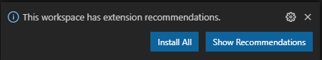
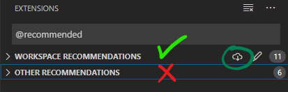
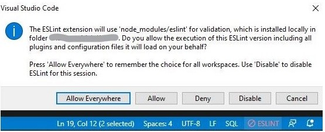
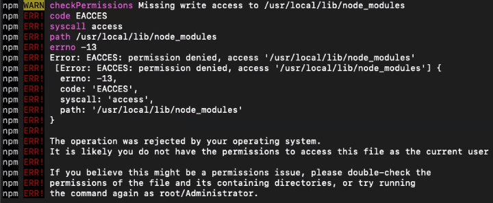
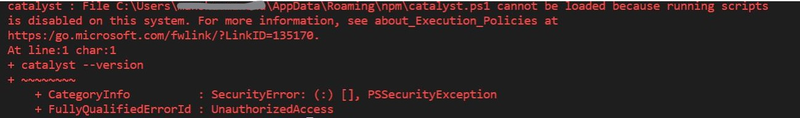
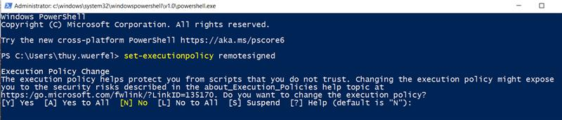
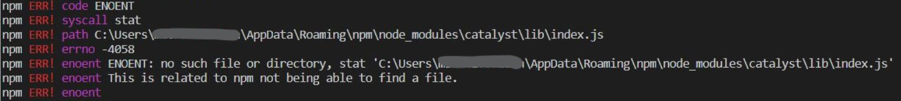
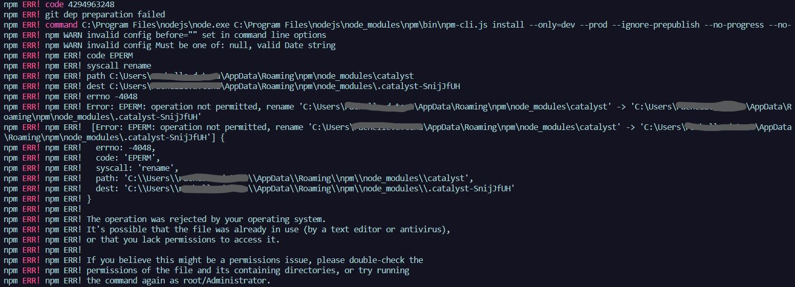
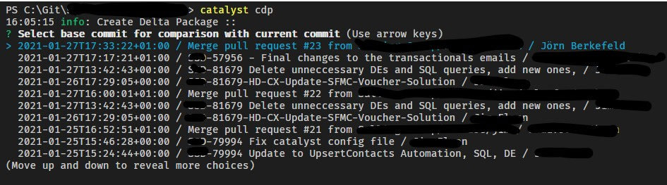

# Accenture SFMC DevTools

<a id="markdown-accenture-sfmc-devtools" name="accenture-sfmc-devtools"></a>

[](https://www.npmjs.com/package/mcdev)

Accenture Salesforce Marketing Cloud DevTools (mcdev) is a rapid deployment/rollout, backup and development tool for Salesforce Marketing Cloud. It allows you to retrieve and deploy configuration and code across Business Units and instances.

<!-- TOC -->

- [1. Changelog](#1-changelog)
- [2. Getting Started](#2-getting-started)
  - [2.1. Pre-requisites](#21-pre-requisites)
    - [2.1.1. Install Node.js with npm](#211-install-nodejs-with-npm)
    - [2.1.2. Install the Git Command Line](#212-install-the-git-command-line)
  - [2.2. Install Accenture SFMC DevTools](#22-install-accenture-sfmc-devtools)
  - [2.3. Initial project setup](#23-initial-project-setup)
  - [2.4. Joining a project that was set up before](#24-joining-a-project-that-was-set-up-before)
  - [2.5. Recommended additional installs](#25-recommended-additional-installs)
  - [2.6 Using mcdev in other node packages](#26-using-mcdev-in-other-node-packages)
- [3. Updating Accenture SFMC DevTools](#3-updating-accenture-sfmc-devtools)
- [4. Troubleshoot Install/Update](#4-troubleshoot-installupdate)
  - [4.1. Installing specific version](#41-installing-specific-version)
  - [4.2. Using custom CLIs](#42-using-custom-clis)
  - [4.3. Missing write access to...on MacOS](#43-missing-write-access-toon-macos)
  - [4.4. ...running scripts is disabled on this system](#44-running-scripts-is-disabled-on-this-system)
  - [4.5. Operation not permitted OR No such file or directory](#45-operation-not-permitted-or-no-such-file-or-directory)
- [5. Metadata Type Support](#5-metadata-type-support)
- [6. Command Overview](#6-command-overview)
  - [6.1. Maintenance and setup commands](#61-maintenance-and-setup-commands)
    - [6.1.1. init](#611-init)
    - [6.1.2. upgrade](#612-upgrade)
    - [6.1.3. reloadBUs](#613-reloadbus)
    - [6.1.4. badKeys](#614-badkeys)
    - [6.1.5. document](#615-document)
    - [6.1.6. selectTypes](#616-selecttypes)
    - [6.1.7. explainTypes](#617-explaintypes)
  - [6.2. Operational commands](#62-operational-commands)
    - [6.2.1. retrieve](#621-retrieve)
    - [6.2.2. deploy](#622-deploy)
    - [6.2.3. delete](#623-delete)
    - [6.2.4. retrieveAsTemplate](#624-retrieveastemplate)
    - [6.2.5. buildDefinition](#625-builddefinition)
    - [6.2.6. buildDefinitionBulk](#626-builddefinitionbulk)
    - [6.2.7. createDeltaPkg](#627-createdeltapkg)
- [7. Advanced Configuration](#7-advanced-configuration)
  - [7.1. Config Options](#71-config-options)
  - [7.2. Metadata specific settings & options](#72-metadata-specific-settings--options)
    - [7.2.1. Retention Policy fields in Data Extensions](#721-retention-policy-fields-in-data-extensions)
    - [7.2.2. Adding/Updating Fields on existing Data Extensions](#722-addingupdating-fields-on-existing-data-extensions)
    - [7.2.3. Renaming fields of a Data Extensions](#723-renaming-fields-of-a-data-extensions)
  - [7.3. Market Configuration](#73-market-configuration)
  - [7.4. Market List Configuration](#74-market-list-configuration)
- [8. Examples](#8-examples)
  - [8.1. Retrieve and deploy Data Extension](#81-retrieve-and-deploy-data-extension)
  - [8.2. Metadata Retrieving/Backup](#82-metadata-retrievingbackup)
  - [8.3. Automation Deployment](#83-automation-deployment)
- [9. Contribute](#9-contribute)
  - [9.1. Install Guide for Developers](#91-install-guide-for-developers)
  - [9.2. Local install](#92-local-install)
  - [9.3. NPM Scripts](#93-npm-scripts)
  - [9.4. Developer Documentation](#94-developer-documentation)

<!-- /TOC -->

## 1. Changelog

<a id="markdown-changelog" name="changelog"></a>

Find info on the latest changes in our [Changelog](CHANGELOG.md).

## 2. Getting Started

<a id="markdown-getting-started" name="getting-started"></a>

Accenture SFMC DevTools can be installed as Node.JS package. The following guide will demonstrate how you can get started within 10 minutes or less.

<a name="pre-requisites"></a>

### 2.1. Pre-requisites

<a id="markdown-pre-requisites" name="pre-requisites"></a>

#### 2.1.1. Install Node.js with npm

<a id="markdown-install-node.js-with-npm" name="install-node.js-with-npm"></a>

1. To check if it is already installed, at the OS command prompt, type: `node --version`
   - If this command reports Node version 14.16.x or later, you’re done—proceed to the next installation. If the reported version is earlier than 14.16.x, continue to step 2.
   - If you get a “command not found” error message, continue to step 2.
2. In a web browser, go to [nodejs.org](https://nodejs.org)
3. Download and run the latest **LTS** installer for your operating system.
4. When the installer finishes, try step 1 again. If it fails, please restart your terminal. If it still does not work, reboot your computer and try the version check then.

#### 2.1.2. Install the Git Command Line

<a id="markdown-install-the-git-command-line" name="install-the-git-command-line"></a>

1. To check if git is already installed, at the OS command prompt, type: `git version`
   - If this command reports a git version such as “git version 2.31.0” (or "git version 2.31.0.windows.1" on Windows), you’re done. Proceed to native Android or iOS environment setup.
   - If you get a “command not found” error message, continue to step 2.
2. Go to [git-scm.com/downloads](https://git-scm.com/downloads).
3. Under Downloads, click the icon for your operating system.
4. Run the installer.
5. When the installer finishes, try step 1 again. If it fails, please restart your terminal. If it still does not work, reboot your computer and try the version check then.

<a name="install-mcdev"></a>

### 2.2. Install Accenture SFMC DevTools

<a id="markdown-install-accenture-sfmc-devtools" name="install-accenture-sfmc-devtools"></a>

If you experience issues installing Accenture SFMC DevTools, please check out the [Troubleshoot Install/Update](#troubleshoot-installupdate) section in this manual.

**How to:**

1. Install Accenture SFMC DevTools by running `npm install -g mcdev` (prefix with `sudo` on MacOS)
   - If you get an error, please see the below troubleshooting section.

When completed you will see `+ mcdev@3.0.0` printed to your screen (or the current version of it respectively).

> **_Side note for proud nerds_:**
>
> The `-g` part behind `npm install` triggers a so-called "global installation". This is a term coined by Package Managers, in this case Node's package manager (npm) and it means that Accenture SFMC DevTools is installed on your computer and usable across projects. The alternative is a "local installation" would install Accenture SFMC DevTools only for the current project folder. This local install is a technique used to ensure everyone in the team is using the same version of a tool. Nevertheless, we strongly recommend going with the global installation to be able to use the full feature-set of Accenture SFMC DevTools.
>
> You may choose to install mcdev globally or locally. Global install runs faster and allows you to initialize new projects by running `mcdev init` in any directory. If your project does require a local installation, please refer to the [Local Install Guide](#local-install).

### 2.3. Initial project setup

<a id="markdown-initial-project-setup" name="initial-project-setup"></a>

After the successful installation, you will now need to setup the connection to your Marketing Cloud instance.

1. In your Marketing Cloud instance
   1. Ensure that you **selected** your **Parent/Global Business Unit**.
   2. Go to `Setup -> Apps -> Installed Packages`.
   3. Create a new installed package and name it "Accenture SFMC DevTools Deployment Tool"
      > Note: On some older SFMC instances it will ask you if you want the enhanced version. Please enable this option.
   4. Click on the _Add Component_ button and select `API Integration` with `Server-To-Server` mode.
   5. Make sure you grant all available rights.
   6. Go to the access tab and grant it access to all Business Units that you want to use it for, but ensure that the Parent/Global Business Unit is among these.
      - _Why?_ Shared Data Extensions, roles, users, Business Unit info and some other metadata is internally stored solely on the parent Business Unit and hence can only be retrieved and updated via that BU.
   7. Note down _Client Id_, _Client Secret_ and _Authentication Base URI_.
2. In your project folder
   1. Open a CLI in your project folder (e.g. `C:\repos\MyProject\` on Windows or `~/repos/MyProject/` on Mac)
   2. Run `mcdev init` to start the interactive setup wizard.
      1. If not found yet, default configuration files will be copied into your project folder, copied by initializing an npm project and a local Git repository.
      2. The wizard will ask you to name your credential. The name you choose here will be used by all team members because the config is shared via Git.
         > Being specific here reduces the chance of deploying to the wrong server (instance) in stressful situations. We suggest you use something like `ClientName`, or `ClientName-ProjectName` if you have multiple projects with the same client. In case your project uses multiples instances you might like to use something like `Client-ProjectName-Sandbox` and `Client-ProjectName-PROD`.
      3. It will then continue to ask for the client ID, client secret and Authentication Base URI.
      4. The credentials will be automatically tested & your list of BUs downloaded until finally the central configuration file `.mcdevrc.json` gets created in your project folder.
      5. Last step is to download an initial backup and commit it into git. No worries - the wizard does that for you!
   3. If this is the first time you set up Accenture SFMC DevTools or you recently upgraded Accenture SFMC DevTools, please restart VS Code now! A pop-up will likely appear in the lower right corner prompting you to install recommended extensions.
   4. Done.
3. Sharing the project with your team
   1. Make sure you have a Git repo (Bitbucket, GitHub, GitLab) set up somewhere. If you are an SI partner, usually, your client will have to do this for you.
      > While running `mcdev init`, the tool already made sure to set up a local Git repo for you. Now, you need to upload ("push") it to the online repo:
   2. Open the URL of your online repo and find the "CLONE" button. This will likely show you a normal URL, ending on ".git"
   3. Add this as your repository remote named "origin". If you use a GUI based tool, that should be fairly simple, otherwise execute `git remote add origin YOUR-URL` in your project folder.
   4. Now run `git push -u origin master` to actually start the upload.

### 2.4. Joining a project that was set up before

<a id="markdown-joining-a-project-that-was-set-up-before" name="joining-a-project-that-was-set-up-before"></a>

If Accenture SFMC DevTools was already used to set up the project by somebody in your team, including all of the steps in the above chapter [Initial project configuration](#initial-project-setup), then basically you are in luck. Things are much faster from here on:

1. Make sure you went through the chapters [Pre-requisites](#pre-requisites) and [Install Accenture SFMC DevTools](#install-mcdev). Do skip [Initial project configuration](#initial-project-setup)!
2. Acquire the URL to your Git repo and Clone it to your computer. It should end on `.git`. Also ask your team lead for `Client ID`, `Client Secret` and the `Authentication Base URI`. You will need this later.
   > We recommend you create a folder like `C:\repos\` and clone the repo for your current project into that. By default, the repo name will be suggested as a sub-folder name which you should keep in place. That way you will always have one folder in which all your projects can be found in with their respective sub-folders.
3. Open your main repo folder (e.g. `C:\repos\`) in the CLI of your choice (e.g. PowerShell on Windows)
4. now execute `git clone YOUR-REPO-URL`. This will create a sub-folder with the name of the repo and download everything for you into it (e.g. `C:\repos\YOUR-REPO\`)
5. Still in the command prompt, execute `cd YOUR-REPO`. This will switch your current folder (visible before the command prompt) to the new repo folder (`C:\repos\YOUR-REPO\`).
6. Assuming you installed Accenture SFMC DevTools globally (recommended!), now execute `mcdev init`.
7. At this point the system will recognize the previously set up project and ask you for `Client ID`, `Client Secret` and the `Authentication Base URI`.
8. Done.

### 2.5. Recommended additional installs

<a id="markdown-recommended-additional-installs" name="recommended-additional-installs"></a>

The following seeks to enhance your daily process. Our guide assumes that you are using [Visual Studio Code](https://code.visualstudio.com/download) to develop, backup and deploy your project. For smooth operations we highly recommend the following Marketing Cloud specific plugins for it.

Nevertheless, Accenture SFMC DevTools will run without them and is not associated with the development of these publicly available apps & plugins.

> **Note:** The following lists are automatically installed when you run `mcdev init` or `mcdev upgrade`.

**Visual Studio Code extensions:**

When you run `mcdev init` or `mcdev upgrade` we add/update the file `.vscode/extensions.json` in your project directory with a list of recommended VSCode extensions that will help your daily workflow with Salesforce Marketing Cloud.

Restart VS Code after cloning a prepared repo or after you've run `init` / `upgrade` and VS Code will prompt you in the lower right corner with:



Click on `Install All` to quickly get things ready or review the recommendations first via `Show Recommendations`. If you opt for the second option, be aware that there are 2 kinds of recommendations:



The "Workspace Recommendations" were defined by Accenture SFMC DevTools. Clicking on the little cloud icon will install all at once. The "Other Recommendations" are auto-generated by VS Code and are not controlled by Accenture SFMC DevTools. You _may_ look through those as well, but they might also be completely irrelevant for you.

**Node modules:**

- [eslint](https://npmjs.com/package/eslint): code linting
- [eslint-config-prettier](http://npmjs.com/package/eslint-config-prettier): ensures that prettier and eslint dont have conflicting rules
- [eslint-config-ssjs](http://npmjs.com/package/eslint-config-ssjs): allows you to have accurate code linting in \*.SSJS files
- [eslint-plugin-jsdoc](http://npmjs.com/package/eslint-plugin-jsdoc): will help you write proper jsdoc comments in your SSJS code
- [eslint-plugin-prettier](http://npmjs.com/package/eslint-plugin-prettier): runs prettier and eslint together
- [prettier](https://prettier.io): opinionated code formatter
- [npm-check](http://npmjs.com/package/npm-check): makes it easier to keep your node modules up-to-date
- [sfmc-boilerplate](http://npmjs.com/package/sfmc-boilerplate): build tool for your more complex email, cloudpage and automation code.

Please note that Visual Studio Code might warn you about using the local installation of ESLint with a pop up like the following. Please confirm this with `Allow` or, if you are certain about what you are doing, with `Allow Everywhere`. Inside of Accenture SFMC DevTools project folders this warning is normal, because we ask to install the VSCode extension and the node module for ESLint.



### 2.6 Using mcdev in other node packages

Install it locally first via the following (or with a [specific version](#41-installing-specific-version)):

```bash
npm install --save mcdev
```

And then require it in your code:

```javascript
const mcdev = require('mcdev');

// download all metadata from your instance's Parent BU
mcdev.retrieve('MyCredential/_ParentBU_');

// or download all metadata from your instance's Parent BU
mcdev.retrieve('MyCredential/_ParentBU_', 'dataExtension');
```

For more details on the available methods look out for what Intellisense will return or refer to the [developer documentation](docs/dist/documentation.md).

<a name="updating-mcdev"></a>

## 3. Updating Accenture SFMC DevTools

<a id="markdown-updating-accenture-sfmc-devtools" name="updating-accenture-sfmc-devtools"></a>

If you have mcdev already installed you can update your installation in a simplified way:

```bash
npm update -g mcdev
```

<a name="troubleshoot-installupdate"></a>

## 4. Troubleshoot Install/Update

<a id="markdown-troubleshoot-install%2Fupdate" name="troubleshoot-install%2Fupdate"></a>

### 4.1. Installing specific version

<a id="installing-specific-version" name="installing-specific-version"></a>

To work with our **developer-version** or to install a **specific older version** you can select any branch or tag from our git repository during install to do so:

**Most recent developer version (using the GitHub repo & branch name):**

```bash
npm install -g accenture/sfmc-devtools#develop
```

**Install specific version (using a version tag on npm):**

```bash
npm install -g mcdev@3.1.0
```

**Warning**: When you used the above method to install Accenture SFMC DevTools for a specific version or tag, trying to [update Accenture SFMC DevTools](#updating-mcdev) might not download the most recently published official version but instead stay on the version or branch you previously selected (in the above examples: develop, 3.1.0)!

> **Note**: The version is currently _not_ updated on the developer branch until a new release is published. Hence, you will not see a change if you run `mcdev --version`.

### 4.2. Using custom CLIs

<a id="markdown-using-custom-clis" name="using-custom-clis"></a>

Some users of Accenture SFMC DevTools prefer to use git bash or other CLIs instead of the operating system's default. Please note that some of the functionality of Accenture SFMC DevTools but also of other tools like the Node package manager (npm) do not necessarily function properly in these.

If you encounter problems, we strongly recommend to first try it in the default CLI.

<a name="missing-write-access-toon-macos"></a>

### 4.3. Missing write access to...on MacOS

<a id="markdown-missing-write-access-to...on-macos" name="missing-write-access-to...on-macos"></a>

Depending on your setup, the default global installs & updates might error out with "Missing write access to /usr/local/lib/node_modules". In this case prefix your command with `sudo`:

```bash
sudo npm install -g mcdev
```

```bash
sudo npm update -g mcdev
```



### 4.4. ...running scripts is disabled on this system

<a id="markdown-...running-scripts-is-disabled-on-this-system" name="...running-scripts-is-disabled-on-this-system"></a>

If you see the below error then your system's security settings are rather strict.



Steps to solve this:

1. Start Windows PowerShell with the "Run as Administrator" option.
2. Input the following and then hit ENTER: `set-executionpolicy remotesigned`
3. This will likely show a lenghty message with a question to confirm the change (screenshot below). Please type `y` (="yes") and confirm with `Enter`.



Please note that this change is global and not just for your current folder.

### 4.5. Operation not permitted OR No such file or directory

<a id="markdown-operation-not-permitted-or-no-such-file-or-directory" name="operation-not-permitted-or-no-such-file-or-directory"></a>

If you encounter out of the 3 following errors you will have to completely remove Node.JS and install it again afterwards.

**Error 1:** Cannot find module index.js



**Error 2:** Operation not permitted



**How to completely remove Node.js from Windows:**

1. Run npm cache clean --force

2. Uninstall it via the system's `Add or remove programs` (find it by searching in the start menu).

3. Reboot your computer.

4. Look for these folders and remove them (and their contents) if any still exist. Depending on the version you installed, UAC settings, and CPU architecture, these may or may not exist:

   - C:\Program Files (x86)\Nodejs
   - C:\Program Files\Nodejs
   - C:\Users\\{User}\AppData\Roaming\npm
     - (or %appdata%\npm)
   - C:\Users\\{User}\AppData\Roaming\npm-cache
     - (or %appdata%\npm-cache)
   - C:\Users\\{User}\.npmrc (and possibly check for that without the . prefix too)
   - C:\Users\\{User}\npmrc
   - C:\Users\\{User}\AppData\Local\Temp\npm-\*

5. Check your %PATH% environment variable to ensure no references to Nodejs or npm exist.

6. If it's still not uninstalled, type `where node` at the command prompt and you'll see where it resides -- delete that (and probably the parent directory) too.

7. Reboot again!

**Re-install Node.js and Accenture SFMC DevTools:**

Now, please follow the guides above in the [Pre-requisites](#pre-requisites) section to Install Node.js again and afterwards try again to [install Accenture SFMC DevTools](#install-mcdev).

<a name="metadata-type-support"></a>

## 5. Metadata Type Support

<a id="markdown-metadata-type-support" name="metadata-type-support"></a>

The following metadata types are currently supported:

| MetadataType                       | CLI Argument              | Retrieve | Deploy     | Template   | Retrieved by Default | Description                                                                                                        |
| ---------------------------------- | ------------------------- | -------- | ---------- | ---------- | -------------------- | ------------------------------------------------------------------------------------------------------------------ |
| API Discovery                      | `discovery`               | Yes      | -          | -          | -                    | Description of all API endpoints accessible via REST API; only relevant for developers of Accenture SFMC DevTools. |
| Asset                              | `asset`                   | Yes      | Yes        | Yes        | Yes                  | Assets from Content Builder grouped into subtypes.                                                                 |
| Automation                         | `automation`              | Yes      | Yes        | Yes        | Yes                  | Used via Automation Studio directly - or indirectly via Journey Builder & MC Connect.                              |
| Automation: Data Extract Activity  | `dataExtract`             | Yes      | Yes        | Yes        | Yes                  | Creates zipped files in your FTP directory or convert XML into CSV.                                                |
| Automation: File Transfer Activity | `fileTransfer`            | Yes      | Yes        | Yes        | Yes                  | Unzip, decrypt a file or move a file from secure location into FTP directory.                                      |
| Automation: Filter Activity        | `filter`                  | Beta     | in backlog | in backlog | -                    | Part of how filtered Data Extensions are created. Depends on type "FilterDefinitions".                             |
| Automation: Import File Activity   | `importFile`              | Yes      | Yes        | Yes        | Yes                  | Reads files in FTP directory for further processing.                                                               |
| Automation: SQL Query Activity     | `query`                   | Yes      | Yes        | Yes        | Yes                  | Select & transform data using SQL.                                                                                 |
| Automation: Script Activity        | `script`                  | Yes      | Yes        | Yes        | Yes                  | Execute more complex tasks via SSJS or AMPScript.                                                                  |
| Campaign Tag                       | `campaign`                | Yes      | in backlog | in backlog | Yes                  | Way of tagging/categorizing emails, journeys and alike.                                                            |
| Content Area (Classic)             | `contentArea`             | Yes      | -          | -          | -                    | **DEPRECATED**: Old way of saving Content Blocks; please migrate these to new Content Blocks (`Asset: ...`).       |
| Data Designer Attribute Groups     | `attributeGroup`          | Beta     | in backlog | in backlog | -                    | Groupings of Set Definitions (Data Extensions) in Data Designer.                                                   |
| Data Designer Set Definitions      | `setDefinition`           | Beta     | in backlog | in backlog | -                    | Data Extensions linked to Attribute Groups in Data Designer.                                                       |
| Data Extension                     | `dataExtension`           | Yes      | Yes        | Yes        | Yes                  | Database table schemas.                                                                                            |
| Data Extension Template            | `dataExtensionTemplate`   | Yes      | -          | -          | -                    | OOTB Database table schemas used for special cases like Transactional Journeys.                                    |
| Data Extract Type                  | `dataExtractType`         | Yes      | -          | -          | -                    | Types of Data Extracts enabled for a specific business unit. This normally should not be stored.                   |
| E-Mail (Classic)                   | `email`                   | Yes      | -          | -          | -                    | **DEPRECATED**: Old way of saving E-Mails; please migrate these to new E-Mail (`Asset: message`).                  |
| E-Mail Send Definition             | `emailSendDefinition`     | Yes      | Yes        | in backlog | Yes                  | Mainly used in Automations as "Send Email Activity".                                                               |
| Folder                             | `folder`                  | Yes      | Yes        | in backlog | -                    | Used to structure all kinds of other metadata.                                                                     |
| FTPLocation                        | `ftpLocation`             | Yes      | -          | -          | Yes                  | A File Location which can be used for export or import of files to/from Marketing Cloud.                           |
| Journey                            | `interaction`             | Yes      | in backlog | in backlog | -                    | Journey from Builder (internally called "Interaction").                                                            |
| Journey: Entry Event Definition    | `eventDefinition`         | Yes      | Yes        | in backlog | -                    | Used in Journeys (Interactions) to define Entry Events.                                                            |
| List                               | `list`                    | Yes      | in backlog | -          | Yes                  | Old way of storing data. Still used for central Email Subscriber DB.                                               |
| Role                               | `role`                    | Yes      | Yes        | -          | Yes                  | User Roles define groups that are used to grant users access to SFMC systems.                                      |
| Triggered Send                     | `triggeredSendDefinition` | Yes      | Yes        | -          | Yes                  | **DEPRECATED**: Sends emails via API or DataExtension Event.                                                       |
| User                               | `accountUser`             | Yes      | in backlog | -          | -                    | Users and Installed Packages including their assigned Roles, BUs and personal permissions                          |

## 6. Command Overview

<a id="markdown-command-overview" name="command-overview"></a>

If you installed mcdev globally as described above you can run mcdev in any directory. See our [install Accenture SFMC DevTools](#install-mcdev) chapter for more details.

_Example (global install):_

```bash
mcdev retrieve
```

If you installed Accenture SFMC DevTools as a local dependency (**not recommended**) to the current directory then you will have to add `npx` in front of each command. See our [Local install](#local-install) chapter for more details.

_Example (local install):_

```bash
npx mcdev retrieve
```

The following description will assume a global installation for simplicity reasons.

_Note:_ Parameters listed below in between square brackets = `[...]` are optional parameters. Required parameters are listed in between less-than / greater-than signs = `<...>`.

_Note:_ Credentials and Business Unit names can always be selected interactively. Try inputing a questionmark = `?` in their place if more parameters follow, or omit them completely if no other parameters are required for a command.

### 6.1. Maintenance and setup commands

<a id="markdown-maintenance-and-setup-commands" name="maintenance-and-setup-commands"></a>

#### 6.1.1. init

<a id="markdown-init" name="init"></a>

_Command:_ `mcdev init`

_Alias:_ -

Creates the basic configuration file `.mcdevrc.json` and `.mcdev-auth.json` in your project directory. You may add more credentials by re-running the same command again, e.g. to add produciton and sandbox credentials next to each other.

In addition, it initializes an npm package for your, installs recommended npm dependencies and places our default IDE configuration files for ESLint, Prettier, Git and VSCode into your project directory.

The initialization ends with the creation of your Git repository and a first backup of your SFMC instance.

_Example - initialize project / add additional credentials:_

```bash
mcdev init
```

_Example - update credentials:_

```bash
mcdev init yourCredentialName
```

The interactive setup will ask you for a `Client ID` and `Client Secret` of an enhanced installed package (default since August 2019). It also asks for the `Authentication Base Uri`. Each installed package on a given SFMC instance shares the same tenant sub-domain and always shows you 3 domains (Auth, REST and SOAP).

Example url: `https://mcg123abcysykllg-0321cbs8bbt64.auth.marketingcloudapis.com`

> **Note to CLI experts:**
>
> You can run this command without the interactive wizard asking questions using the `--skipInteraction` (or short`--yes`/`--y`) flag. In this case, you need to provide a few values in the command:
>
> ```bash
> mcdev init --y.credentialsName "yourCustomCredentialName" --y.clientId "yourClientIdHere" --y.clientSecret "yourClientSecretHere" --y.tenant "yourTenantSubdomainHere" --y.gitRemoteUrl "https://my.git.server.com/myrepo.git"
> ```
>
> To get the tenant subdomain, please take the Authentication Base Uri and extract the part after `https://` and before `.auth.marketingcloudapis.com`. In the above example this would therefore be `mcg123abcysykllg-0321cbs8bbt64`.

#### 6.1.2. upgrade

<a id="markdown-upgrade" name="upgrade"></a>

_Command:_ `mcdev upgrade`

_Alias:_ `mcdev up`

This upgrades older Accenture SFMC DevTools projects to the newest standard: Outdated Accenture SFMC DevTools configuration files are upgraded and the right npm dependencies are installed. It also copies in the right IDE configuration files. See [init](#init) for more details.

_Example:_

```bash
mcdev upgrade
```

#### 6.1.3. reloadBUs

<a id="markdown-reloadbus" name="reloadbus"></a>

_Command:_ `mcdev reloadBUs [credential]`

_Alias:_ `mcdev rb`

Use this to synchronize your local list of available Business Units for a given credential. This is useful if you've added, deleted or renamed Business Units on your SFMC instance and want to make sure that your local setup reflects that - or if you accidentally changed your config file and want to restore it.

_Example:_

```bash
mcdev reloadBUs MyProject
```

#### 6.1.4. badKeys

<a id="markdown-badkeys" name="badkeys"></a>

_Command:_ `mcdev badKeys [business unit]`

_Alias:_ -

Lists all metadata for which the External key is not in synch with the name to enable you to update them quickly.

_Example:_

```bash
mcdev badKeys MyProject/DEV
```

#### 6.1.5. document

<a id="markdown-document" name="document"></a>

_Command:_ `mcdev document <TYPE> <business unit>`

_Alias:_ `mcdev doc`

Creates human readable documentation for your metadata. This command is executed by default unless you changed your config manually to set `options.documentOnRetrieve : false`. Therefore, running it manually is typically not required. You can choose to generate **HTML** (`html`) or **Markdown** (`md`) docs via `options.documentType`.

The default format is set to `md` as Markdown renders nicely in Git as well as in VSCode's Markdown preview and can be copied from there into Confluence and other applications without losing the formatting.

Currently supported types:

| Name           | CLI Argument    |
| -------------- | --------------- |
| Data Extension | `dataExtension` |
| Role           | `role`          |
| User           | `accountUser`   |

_Example:_

```bash
mcdev document role myServer
```

#### 6.1.6. selectTypes

<a id="markdown-selecttypes" name="selecttypes"></a>

_Command:_ `mcdev selectTypes`

_Alias:_ `mcdev st`

Allows you to interactive select which metadata is retrieved when you run the `retrieve` command. Try out `explainTypes` first to understand what each type means.

_Example:_

```bash
mcdev selectTypes
```

_Note:_ You may select non-standard types if you run `mcdev selectTypes --debug`. This may be needed in edge cases but is not recommended in most situations.

#### 6.1.7. explainTypes

<a id="markdown-explaintypes" name="explaintypes"></a>

_Command:_ `mcdev explainTypes`

_Alias:_ `mcdev et`

A helper command for `selectTypes` that prints out a table that defines what the various types actually are.

Types marked as not-default should be ignored. These are either under development or merely meant to support contributing to Accenture SFMC DevTools.

_Example:_

```bash
mcdev explainTypes
```

### 6.2. Operational commands

<a id="markdown-operational-commands" name="operational-commands"></a>

#### 6.2.1. retrieve

<a id="markdown-retrieve" name="retrieve"></a>

_Command:_ `mcdev retrieve [business unit] [metadata type]`

_Alias:_ `mcdev r`

Retrieves all metadata from the specified Business Unit. You can limit what types are retrieved by default using the `selectTypes` command or by changing the list in the config file directly.

_Example:_

```bash
mcdev retrieve MyProject/DEV
```

You can ommit the Business Unit which will trigger and interactive mode based on your config:

_Example:_

```bash
mcdev retrieve
```

If you already know the credentials name but want to only select the Business Unit interactively try this
_Example:_

```bash
mcdev retrieve MyProject
```

**retrieve specific type:**

If you want to retrieve only a certain metadata type, let's say `script`, then pass this type in as a second parameter. The other types will remain untouched and in place, if you've previously retrieved them.

_Example:_

```bash
mcdev retrieve MyProject/DEV script
```

**retrieve all BUs:**

A special variant of this command allows you to retrieve all Business Units of a given credential at once.
_Example:_

```bash
mcdev retrieve MyProject/*
```

or even

```bash
mcdev retrieve "*"
```

> Note: retrieve-all will fail in some CLIs if you do not wrap the asterix (\*) in quotes. This is due to the special meaning of \* as a parameter in these CLIs.

#### 6.2.2. deploy

<a id="markdown-deploy" name="deploy"></a>

_Command:_ `mcdev deploy [business unit] [metadata type]`

_Alias:_ `mcdev d`

Deploys metadata to the specified Business Unit.
_Example:_

```bash
mcdev deploy MyProject/DEV
```

Only metadata that you copied into the **deploy** directory will be deployed. Please keek in mind that the folder structure needs to be similar to what the retrieve command creates in the retrieve folder, including the credentials and Business Unit name.

Similarly to `mcdev retrieve` you can also use the interactive mode to select credential and/or Business Unit.

**deploy sepcific type:**

If you want to deploy only a certain metadata type, let's say `dataExtension`, then pass this type in as a second parameter. If there are other types in the current BU's deploy folder, these will be ignored and hence _not_ uploaded.

_Example:_

```bash
mcdev deploy MyProject/DEV dataExtension
```

**deploy all BUs:**

A special variant of this command allows you to dpeloy all Business Units of a given credential at once.
_Example:_

```bash
mcdev deploy MyProject/*
```

or even

```bash
mcdev deploy "*"
```

> Note: deploy-all will fail in some CLIs if you do not wrap the asterix (\*) in quotes. This is due to the special meaning of \* as a parameter in these CLIs.

#### 6.2.3. delete

<a id="markdown-delete" name="delete"></a>

_Command:_ `mcdev delete <business unit> <type> <external key>`

_Alias:_ `mcdev del`

Deletes the given metadata from your server. This needs to be run with care as any **data** stored in the deleted _meta_-data **will be lost**.

Currently supported types:

| Name           | CLI Argument    |
| -------------- | --------------- |
| Data Extension | `dataExtension` |
| Data Extension Field | `dataExtensionField` |
| Email Send Definition | `Email Send Definition` |
| List | `list` |
| Triggered Send | `triggeredSendDefinition` |

_Example:_

```bash
mcdev delete MyProject/_ParentBU_ dataExtension MyUserTable
```

#### 6.2.4. retrieveAsTemplate

<a id="markdown-retrieveastemplate" name="retrieveastemplate"></a>

_Command:_ `mcdev retrieveAsTemplate <business unit> <type> <name> <market>`

_Alias:_ `mcdev rt`

The `rt` command retrieves metadata from the server and uses your `market` configuration in `.mcdevrc.json` to replace strings with variables. The result is then stored in your `template/` folder. Please note that files stored here will keep their original name, despite this possibly containing market-specific suffixes or similar. Also note, that contrary to the deploy & retrieve folders, you will not see credential- or Business Unit-sub-folders here.

This command is a prerequisite for the `buildDefintion` command. Alternatively though, you can copy-paste retrieved metadata from your `retrieve/` folder to your `template/` folder and update it manually - or even create it from scratch.

> **Note**: Before using this command, you need to configure your markets first! Check out our guide on [Market Configuration](#market-configuration) to understand how to use templating and prepare your market config.

Currently supported types: Check out [Metadata Type Support](#metadata-type-support).

_Example:_

```bash
mcdev rt MyProject/DEV dataExtension MyUserTable pilotMarketDEV1
```

This will result in `MyUserTable.dataExtension-meta.json` being created in your `template/` directory:

**retrieveAsTemplate for multiple sources:**

You can also create multiple templates with multiple sources at once. Simply specify them in a comma-separated list and put that list in quotes:

```bash
mcdev rt MyProject/DEV dataExtension "table1,table2,table3" pilotMarketDEV1
```

This will result in the following files being created in your `template/` directory:

- `table1.dataExtension-meta.json`
- `table2.dataExtension-meta.json`
- `table3.dataExtension-meta.json`

#### 6.2.5. buildDefinition

<a id="markdown-builddefinition" name="builddefinition"></a>

_Command:_ `mcdev buildDefinition <business unit> <type> <name> <market>`

_Alias:_ `mcdev bd`

The `buildDefinition` command allows to prepare deployments to one or multiple targets based on templates and [Market Configuration](#market-configuration).
After you have created your templates via `retrieveAsTemplate` (or manually) in your `template/dataExtension/` folder run this command to create the final deployable files in your respective `retrieve/<business unit>/` folder.

This allows you to double-check if you actually changed something by comparing the before and after using your favorite Git client. You then have to manually copy files you want to deploy into the respective `deploy/` folder.

> **Note**: Before using this command, you need to configure your markets first! Check out our guide on [Market Configuration](#market-configuration) to understand how to use templating and prepare your market config.

Currently supported types: Check out [Metadata Type Support](#metadata-type-support).

_Example:_

```bash
mcdev bd MyProject/QA dataExtension MyUserTable pilotMarketQA1
```

This will result in the following files being created in your `retrieve/MyProject/QA/dataExtension/` directory:

- `MyUserTable.dataExtension-meta.json`

**buildDefinition for multiple sources:**

You can also create defintions based on multiple templates at once. Simply specify them in a comma-separated list and put that list in quotes:

```bash
mcdev bd MyProject/QA dataExtension "table1,table2,table3" pilotMarketDEV1
```

This will result in the following files being created in your `retrieve/MyProject/QA/dataExtension/` directory:

- `table1.dataExtension-meta.json`
- `table2.dataExtension-meta.json`
- `table3.dataExtension-meta.json`

#### 6.2.6. buildDefinitionBulk

<a id="markdown-builddefinitionbulk" name="builddefinitionbulk"></a>

_Command:_ `mcdev buildDefinitionBulk <list name> <type> <name>`

_Alias:_ `mcdev bdb`

With `buildDefinitionBulk` you get a very powerful command that wraps around `buildDefinition`, which it executes internally. It allows you to create the definitions for multiple Business Units and multiple markets at once.

Instead of passing in the name of credentials, Business Units and markets, you simply refer to a pre-defined market list in your `.mcdevrc.json`. This enables you to re-use the same configs over and over again, across multiple deployments and share it with your team.

**Note**: Before using this command, you need to configure your markets first! Check out our guide on [Market List Configuration](#market-list-configuration) and [Market Configuration](#market-configuration) to understand how to use **bulk** templating and prepare your market config.

_Example:_

```bash
mcdev bdb pilotMarketsQA dataExtension MyUserTable
```

#### 6.2.7. createDeltaPkg

<a id="markdown-createdeltapkg" name="createdeltapkg"></a>

_Command:_ `mcdev createDeltaPkg [range] [filter]`

_Alias:_ `mcdev cdp`

This command is rather versitile and hence can be used in multiple ways. The most powerful option presents itself when you configure `options.deployment.sourceTargetMapping` to point to a source `marketList` (usually for DEV-BU with a DEV market) and a target `marketList` (e.g. to a QA BU-market combo and a Production BU-market combo). Given this is configured, it can create all deployable files using Accenture SFMC DevTools's templating engine on the fly for you.

The **minimum configuration** you need to have in your config could look something like the following:

> Note: the following example does not show all necessary parts of the config, just those that are needed for createDeltaPkg.
>
> The example tells createDeltaPkg that the source BU is called `MyProject/DEV` and that the there are two target for deployment, `MyProject/QA` and `MyProject/PROD`. Furthermore it associates the markets `dev`, `qa` and `prod` to these BUs to ensure templating is applied - however, the markets in this example are empty which means no actual string replacement will occur. This is normal for most basic cases in which you would expect 1:1 copies on DEV, QA and PROD.
>
> When MC Connect is used, one would expect to see the External Keys of the Synchronized DataExtensions to be mentioned in the markets for easy auto-replacement.

```json
{
  "credentials": {
    "MyProject": {
      "businessUnits": {
        "DEV": "1235",
        "QA": "1236",
        "PROD": "1237"
      }
    }
  },
  "options": {
    "deployment": {
      "commitHistory": 10,
      "sourceTargetMapping": {
        "deployment-source": "deployment-target"
      }
    }
  },
  "directories": {
    "deltaPackage": "docs/deltaPackage/",
    "deploy": "deploy/",
    "retrieve": "retrieve/",
    "template": "template/",
    "templateBuilds": ["retrieve/", "deploy/"]
  },
  "markets": {
    "dev": {},
    "qa": {},
    "prod": {}
  },
  "marketList": {
    "deployment-source": {
      "description": "Define one 1:1 BU-Market combo here to as source for automated creation of deployment packages; you can create more than one source market list",
      "MyProject/DEV": "dev"
    },
    "deployment-target": {
      "description": "Define n BU-Market combo here to as target for automated creation of deployment packages; you can create more than one target market list and they can be as complex as you like",
      "MyProject/QA": "qa",
      "MyProject/PROD": "prod"
    }
  }
}
```

> **Detailed Background infos:** `createDeltaPkg` internally first compares the 2 commits in Git to find the differences, then executes `retrieveAsTemplate` for all of these found differences, which creates files in your `template/` directory. Finally, it runs `buildDefinitionBulk` for everything, updating your `retrieve/` directory as well as, optionally, your `deploy/` directory, depending on your Accenture SFMC DevTools config's `directories.templateBuilds` value. The update to the first folder enables you to update you branch, while the second folder gives you the right files to immediately deploy to your BUs afterwards (not part of `createDeltaPkg).

**Interactive commit selection:**

This allows you to compare your latest commit (**not** what's still only unstaged/staged) with previous commits. This approach is especially useful if you are a in charge of the deployment and simply want to compare the latest commits to your master / release branch with the commit that was last deployed.

> **Important**: Make sure you are on the branch corresponding to the environment you want to deploy to, e.g. the master branch.

```bash
mcdev createDeltaPkg
```

The output will look something like this:



> _Note: The amount of displayed past commits depends on your Accenture SFMC DevTools configs settings in `options.deployment.commitHistory`. The default value is 10._

**Manual commit selection:**

This is what you would do when you work on a feature branch and want to include the proposed changes for the target BUs already in the branch.

```bash
# Option 1 - RECOMMENDED
# compare based on what you last committed
# you just committed all your changes and want to create the deployment package for master/Production;
# Recommendation: run this before creating a pull request to include the changes in your PR.

mcdev createDeltaPkg master # resolves to master..HEAD
```

Alternatives:

```bash
# the same example with another branch name:
mcdev createDeltaPkg "release/sprint-14" # resolves to release/sprint-14..HEAD

# or even use a commit ID instead of a branch name
mcdev createDeltaPkg d21b4221  # resolves to d21b4221..HEAD


# Option 2 - full git range
# Treat this option with caution because createDeltaPkg always runs retrieveAsTemplate and hence downloads from your DEV BU, not from the git branch.
mcdev createDeltaPkg master..develop
```

**Manual commit selection without templating:**

If you don't want to use templating, you may instead provide the optional `filter` parameter. This will limit

```bash
mcdev createDeltaPkg d21b4221..HEAD 'MyProject/BU1'
```

Range and multiple filters (without templating):

```bash
mcdev createDeltaPkg d21b4221..HEAD 'MyProject/BU1,MyProject/BU3'
```

> **Note to CLI experts:**
>
> If you provide a range you can run this command without the interactive wizard asking questions using the `--skipInteraction` (or short`--yes`/`--y`) flag. This will automatically empty your deploy folder before adding new files. Your command will look like this:
>
> ```bash
> mcdev createDeltaPkg <range> [filter] --y
> ```

## 7. Advanced Configuration

<a id="markdown-advanced-configuration" name="advanced-configuration"></a>

The tools confiuration can be changed in the file `.mcdevrc.json` located in the root of your project folder.

It contains [Market Configuration](#market-configuration) (`markets: { ... }`), [Market List Configuration](#market-list-configuration) (`marketList: { ... }`) the list of usable Business Units per credentials, `directories`, as well as other `options`.

You will also find the configuration for what metadata shall be retrieved here in `metaDataTypes.retrieve: [ ... ]`.

You will also find a secondary file named `.mcdev-auth.json` containing your credentials. **Do not commit this to your repository!** You should only commit `.mcdevrc.json` as this file contains project wide settings that do not compromise security.

### 7.1. Config Options

<a id="markdown-config-options" name="config-options"></a>

The central config in `.mcdevrc.json` holds multiple adjustable settings:

```json
{
  "options": {
    "deployment": {
      "commitHistory": 10,
      "sourceTargetMapping": {
        "deployment-source": "deployment-target"
      },
      "targetBranchBuMapping": {
        "release/*": "MySandbox/QA-DE",
        "master": ["MyProduction/PROD-DE", "MyProduction/PROD-NL"]
      }
    },
    "documentType": "md",
    "exclude": {
      "role": {
        "CustomerKey": ["excludedRoleKey","excludedOtherRoleKey"]
      }
    },
    "include": {
      "asset": {
        "r__folder_Path": ["Content Builder/only/assets/in/here"]
      },
    },
    "serverTimeOffset": -6
  },
  "directories": {
    "badKeys": "docs/badKeys/",
    "businessUnits": "businessUnits/",
    "dataExtension": "docs/dataExtension/",
    "deltaPackage": "docs/deltaPackage/",
    "deploy": "deploy/",
    "retrieve": "retrieve/",
    "roles": "docs/roles/",
    "template": "template/",
    "templateBuilds": ["retrieve/", "deploy/"]
  },
  "metaDataTypes": {
    "documentOnRetrieve": ["role", "dataExtension"],
    "retrieve": [...]
  }
}
```

| Setting                                  | Default                                      | Description                                                                                                                 |
| ---------------------------------------- | -------------------------------------------- | --------------------------------------------------------------------------------------------------------------------------- |
| options.deployment.commitHistory         | 10                                           | Configures how many commits `createDeltaPkg` will display if no parameters are given                                        |
| options.deployment.sourceTargetMapping   | `{"deployment-source": "deployment-target"}` | Configuration of 1 or many source-target marketList combos for `mcdev createDeltaPkg`                                       |
| options.deployment.targetBranchBuMapping | `{"release/*": "...","master": ["..."]}`     | Can be used by CI/CD pipelines to know what BUs shall be deployed to upon a merge into one of the specified branches        |
| options.documentType                     | 'md'                                         | Defines the format for documentation ('md', 'html', 'both')                                                                 |
| options.exclude.`type`.`field`           | []                                           | Allows you to filter out metadata on retrieve based on their field values, e.g. CustomerKey (previously `options.filter`)   |
| options.include.`type`.`field`           | []                                           | Allows you to filter out metadata on retrieve based on their field values, e.g. CustomerKey                                 |
| options.serverTimeOffset                 | -6                                           | Used to work around quirks in how SFMC handles timezones; For stack4: set to -7 (US Mountain time); others: -6 (US Central) |
| directories.badKeys                      | 'docs/badKeys/'                              | Where the documentation for bad key-name combos is stored on retrieve                                                       |
| directories.businessUnits                | 'businessUnits/'                             | Directory to save BU base details in                                                                                        |
| directories.dataExtension                | 'docs/dataExtension/'                        | Directory for `document dataExtension` output                                                                               |
| directories.deltaPackage                 | 'docs/deltaPackage/'                         | Where `createDeltaPkg` stores its log                                                                                       |
| directories.deploy                       | 'deploy/'                                    | Where `deploy` searches for files to deploy                                                                                 |
| directories.retrieve                     | 'retrieve/'                                  | Where `retrieve` stores downloaded files                                                                                    |
| directories.roles                        | 'docs/roles/'                                | Directory for `document role` output                                                                                        |
| directories.users                        | 'docs/users/'                                | Directory for `document accountUser` output                                                                                 |
| directories.template                     | 'template/'                                  | Where `rt` stores downloaded templates & `bd` retrieves them from                                                           |
| directories.templateBuilds               | ['retrieve/','deploy/']                      | Where `bd` saves final deployment versions in. This can hold multiple directories, e.g. ['retrieve/','deploy/']             |
| metaDataTypes.documentOnRetrieve         | ['role','dataExtension']                     | automatically executes `document` for selected types                                                                        |
| metaDataTypes.retrieve                   | _changes with each release_                  | check [Metadata Type Support](#metadata-type-support) for current list                                                      |

### 7.2. Metadata specific settings & options

<a id="markdown-metadata-specific-settings" name="metadata-specific-settings"></a>

#### 7.2.1. Retention Policy fields in Data Extensions

<a id="markdown-retention-policy-fields-in-data-extensions" name="retention-policy-fields-in-data-extensions"></a>

The way retention policy is saved is a bit misleading and hence we wanted to provide a bit of guidance if you ever need to do a deep dive here.

| Field | Description | Values |
| ------------------------------------ | ---------------------------------------------------------------------------------------------------------------------------------------------------------------------------------------------------------------------------------------------------------------------------------------------------------------------------------- | ---------------------------------------------------------------------- |
| **DataRetentionPeriod**              | this field should print the value of the unit of measure but it unfortunately is off by one (e.g. showing "weeks" instead of "months"). Also, it seems to have no impact on what's stored.<br> We therefore excluded it from retrieve/deploy                                                                                       | -                                                                      |
| **DataRetentionPeriodUnitOfMeasure** | represents drop down for "period after" selection                                                                                                                                                                                                                                                                                  | 6: years<br>5: months<br>4: weeks<br>2: days                           |
| **DataRetentionPeriodLength**        | represents number field for "period after" selection                                                                                                                                                                                                                                                                               | min: 1<br>max: 999                                                     |
| **RowBasedRetention**                | only true if "delete individual records" is selected, otherwise false                                                                                                                                                                                                                                                              | true / false                                                           |
| **ResetRetentionPeriodOnImport**     | true if "Reset period on import" is checked.                                                                                                                                                                                                                                                                                       | This option is always false if "delete individual records" is selected | true / false |
| **DeleteAtEndOfRetentionPeriod**     | true if "delete all records" is selected, otherwise false                                                                                                                                                                                                                                                                          | true / false                                                           |
| **RetainUntil**                      | Normally, this should only be filled if a date, rather than a period was set.<br><br>This is empty for "delete individual records", but filled with a (calculated) date for the other 2 delete options even if "period after" was used.<br> Warning: trying to update a DE is denied when "period after" fields & this is provided | ""<br>or date in US format (m/d/Y H:m:s") "12/6/2021 12:00:00 AM")     |

To **disable retention completely**, ensure that you have the 3 booleans set to false, RetainUntil set to an empty string and no DataRetentionPeriod set (=those 2 attributes not present in file).

To enable "delete All records and data extensions" you have to set RowBasedRetention:false and DeleteAtEndOfRetentionPeriod:false while at the same time providing a date in RetainUntil field or a DataRetentionPeriod via the 2 associated fields.

It seems the 2 other modes were added on top later and hence "all records and data extension" is the default retention mode.

#### 7.2.2. Adding/Updating Fields on existing Data Extensions

<a id="markdown-8-examples" name="8-examples"></a>

There are a few rules to keep in mind when playing with Data Extensions fields:

- The `FieldType` cannot be changed on existing fields; the API returns in error is the attribute is even provided unchanged during an update
- `MaxLength` can be increased or kept on the same value but never decreased during an update
- A Non-Required/Nullable field cannot be set to be required during an UPDATE
- When new fields are added, they can be required, but then also have to have a `DefaultValue` set
- The value for `IsRequired` should be 'true' or 'false'
- The value for `IsPrimary` should be 'true' or 'false'

#### 7.2.3. Renaming fields of a Data Extensions

With a small addition to the Data Extension's JSON it is possible to rename fields via MC DevTools. Imagine the following Data Extension:

```json
{
  "CustomerKey": "Account",
  "Name": "Account",
  "Description": "",
  "IsSendable": "false",
  "IsTestable": "false",
  "Fields": [
    {
      "Name": "BillingCity",
      "Scale": "0",
      "DefaultValue": "",
      "MaxLength": "40",
      "IsRequired": "false",
      "IsPrimaryKey": "true",
      "FieldType": "Text"
    },
    {
      "Name": "BillingCountry",
      "Scale": "0",
      "DefaultValue": "",
      "MaxLength": "80",
      "IsRequired": "false",
      "IsPrimaryKey": "false",
      "FieldType": "Text"
    }
  ],
  "r__folder_Path": "Data Extensions"
}
```

Imagine you wanted to rename `BillingCountry` to `BillingZip` for some reason. Previously, you could either go into the GUI or delete & recreate the field. Now, MC DevTools allows you to specify `Name_new` on the field and the tool will take care of the rest during **deployment**:

```json
{
  "CustomerKey": "Account",
  "Name": "Account",
  "Description": "",
  "IsSendable": "false",
  "IsTestable": "false",
  "Fields": [
    {
      "Name": "BillingCity",
      "Scale": "0",
      "DefaultValue": "",
      "MaxLength": "40",
      "IsRequired": "false",
      "IsPrimaryKey": "true",
      "FieldType": "Text"
    },
    {
      "Name": "BillingCountry" /* old name, keep here for reference during the update! */,
      "Name_new": "BillingZip" /* new name */,
      "Scale": "0",
      "DefaultValue": "",
      "MaxLength": "80",
      "IsRequired": "false",
      "IsPrimaryKey": "false",
      "FieldType": "Text"
    }
  ],
  "r__folder_Path": "Data Extensions"
}
```

All you have to do is deploy the data extension again with Name_new specified for each field that needs to be renamed.

### 7.3. Market Configuration

<a id="markdown-market-configuration" name="market-configuration"></a>

You will want to setup configs for variable parts that change inbetween Business Units. We advise starting this _after_ you've first run the `retrieveAsTemplate` command. This might sound counterintuitive but when you review what was copied into your template folder you will likely spot these variable parts the fastest and can then start setting up your market config. Please consider this an iterative process as you will likely run `rt` followed by another update of your config multiple times until you got it right.

We advise clustering your logical approach into variable things on the **instance parent** (=`_ParentBU_` in Accenture SFMC DevTools), the **environment parent** (under which you cluster your child Business Units for DEV, QA and PROD respectively), and **child Business Units**. Ideally, the instance parent is only used to deploy _Shared Data Extensions_, the environent parent is used for integrations with external services and to separate incoming data via Automations into the respective _Shared Data Extensions_. The child Business Units are then reserved for everything that is run on a market-by-market basis.

_Note:_ We do see it often that instance parent and environment parent are one and the same. This is depending on your client's setup, since Business Units are not for free and clients sometimes decide to save the extra money. Sometimes, you even end up with only one BU for DEV activities, no QA environment - and share the instance parent between DEV and production... This is not the recommnded approach for multiple reasons, including security, but it is the reality in some of our projects.

Here a simple example with one DEV BU, 1 QA BU and 2 PROD BUs:

```json
// example market config in your .mcdevrc.json
"markets": {
        "DEV-NL": {
            "mid": "12345",
            "buName": "DEV - Child NL",
            "sharedFolder": "/Shared Data Extensions/DEV/NL",
            "suffix": "_DEV_NL",
            "countryCodeIn": "'NL'"
        },
        "QA-DE": {
            "mid": "12346",
            "buName": "QA - Child DE",
            "sharedFolder": "/Shared Data Extensions/QA/DE",
            "suffix": "_QA_DE",
            "countryCodeIn": "'DE'"
        },
        "PROD-DE": {
            "mid": "12349",
            "buName": "DE - Germany",
            "sharedFolder": "/Shared Data Extensions/DE - Germany",
            "suffix": "_DE",
            "countryCodeIn": "'DE'"
        },
        "PROD-NL": {
            "mid": "12351",
            "buName": "NL - Netherlands",
            "sharedFolder": "/Shared Data Extensions/NL - Netherlands",
            "suffix": "_NL",
            "countryCodeIn": "'NL'"
        }
}
```

Way more complex example with dedicated "Parent" BUs per enviroment (DEV, QA, PROD) and multiple country-specific BUs for QA and for PROD:

```json
// example market config in your .mcdevrc.json
"markets": {
    "DEV-Parent": {
        "Account_Salesforce": "Account_Salesforce_1",
        "suffix": "_DEV"
    },
    "DEV-NL": {
        "mid": "12345",
        "buName": "DEV - Child NL",
        "sharedFolder": "Shared Items/Shared Data Extensions/DEV/NL",
        "suffix": "_DEV_NL",
        "countryCodeIn": "'NL'"
    },
    "QA-Parent": {
        "Account_Salesforce": "Account_Salesforce_2",
        "suffix": "_QA"
    },
    "QA-DE": {
        "mid": "12346",
        "buName": "QA - Child DE",
        "sharedFolder": "Shared Items/Shared Data Extensions/QA/DE",
        "suffix": "_QA_DE",
        "countryCodeIn": "'DE'"
    },
    "QA-GULF": {
        "mid": "12347",
        "buName": "QA - Child GULF",
        "sharedFolder": "Shared Items/Shared Data Extensions/QA/GULF",
        "suffix": "_QA_GULF",
        "countryCodeIn": "'AE', 'BH', 'IQ', 'KW', 'OM', 'QA', 'SA'"
    },
    "PROD-Parent": {
        "Account_Salesforce": "Account_Salesforce",
        "suffix": ""
    },
    "PROD-AT": {
        "mid": "123458",
        "buName": "AT - Austria",
        "sharedFolder": "Shared Items/Shared Data Extensions/AT - Austria",
        "suffix": "_AT",
        "countryCodeIn": "'AT'"
    },
    "PROD-DE": {
        "mid": "12349",
        "buName": "DE - Germany",
        "sharedFolder": "Shared Items/Shared Data Extensions/DE - Germany",
        "suffix": "_DE",
        "countryCodeIn": "'DE'"
    },
    "PROD-CH": {
        "mid": "12352",
        "buName": "CH - Switzerland",
        "sharedFolder": "Shared Items/Shared Data Extensions/CH - Switzerland",
        "suffix": "_CH",
        "countryCodeIn": "'CH'"
    },
    "PROD-GULF": {
        "mid": "12350",
        "buName": "GULF - Arab states of the Persian Gulf",
        "sharedFolder": "Shared Items/Shared Data Extensions/GULF - Arab states of the Persian Gulf",
        "suffix": "_IC_GULF",
        "countryCodeIn": "'AE', 'BH', 'IQ', 'KW', 'OM', 'QA', 'SA'"
    },
    "PROD-NL": {
        "mid": "12351",
        "buName": "NL - Netherlands",
        "sharedFolder": "Shared Items/Shared Data Extensions/NL - Netherlands",
        "suffix": "_NL",
        "countryCodeIn": "'NL'"
    }
}
```

<a name="market-list-configuration"></a>

### 7.4. Market List Configuration

<a id="markdown-market-list-configuration" name="market-list-configuration"></a>

Market Lists are very powerful and you will quickly notice how much time they can safe you during your deployment preparation.
Let's first look at an example list config:

```json
// this is a market-list-config based on the example market-config listed above!
"markets": {...},
"marketList": {
    "deployment-source": {
        "description": "Define one 1:1 BU-Market combo here to as source for automated creation of deployment packages; you can create more than one source market list",
        "MySandbox/DEV-NL": "DEV-NL"
    },
    "deployment-target": {
        "description": "Define n BU-Market combo here to as target for automated creation of deployment packages; you can create more than one target market list and they can be as complex as you like",
        "MySandbox/QA-DE": "QA-DE",
        "MyProduction/PROD-DE": "PROD-DE",
        "MyProduction/PROD-NL": "PROD-NL"
    }
}
```

The above can be used together with `createDeltaPkg` command.

Way more complex example:

```json
// this is a market-list-config based on the example market-config listed above!
"markets": {...},
"marketList": {
    "Parent-shared": {
        "description": "used to deploy shared data extensions",
        "MySandbox/_ParentBU_": ["QA-DE", "QA-GULF"],
        "MyProduction/_ParentBU_": ["PROD-AT", "PROD-CH", "PROD-DE", "PROD-GULF", "PROD-NL"]
    },
    "Parent-medium": {
        "description": "if you use the instance's parent BU also for imports",
        "MySandbox/_ParentBU_": "QA-Parent",
        "MyProduction/_ParentBU_": "PROD-Parent"
    },
    "Parent-large": {
        "description": "very large projects often decide against using the instance parent to get more order into the chaos and define their own 'parents' instead",
        "MySandbox/QA-_Parent_": "QA-Parent",
        "MyProduction/ProjectX-_Parent_": "PROD-Parent"
    },
    "Parent-medium-multi": {
        "description": "equal to Parent-shared"
    },
    "Parent-large-multi": {
        "description": "use to deploy market-adapted queries to your parent BUs",
        "MySandbox/QA-_Parent_": ["QA-DE", "QA-GULF"],
        "MyProduction/ProjectX-_Parent_": [
            "PROD-AT",
            "PROD-CH",
            "PROD-DE",
            "PROD-GULF",
            "PROD-NL"
        ]
    },
    "Children": {
        "description": "use this to deploy to your market BUs",
        "MySandbox/QA-DE": "QA-DE",
        "MySandbox/QA-GULF": "QA-GULF",
        "MyProduction/PROD-Child_AT": "PROD-AT",
        "MyProduction/PROD-Child_CH": "PROD-CH",
        "MyProduction/PROD-Child_DE": "PROD-DE",
        "MyProduction/PROD-Child_GULF": "PROD-GULF",
        "MyProduction/PROD-Child_NL": "PROD-NL"
    }
}
```

First off, we don't see DEV in here. If you have more than one market in DEV then this might deviate but in general, you don't want to bulk-deploy to DEV as this is your single source of truth.

Apart from that we can see 4 types of lists here:

1. `Parent-shared` (_instance parent_): This would be used to deploy the Shared Data Extensions to the instance parent. The child-configs are listed in an array to ensure we end up with one file per child in our parent BU folder.
2. `Parent-medium`/`Parent-large` (medium:_instance parent_; large:_environment parent_): A 1:1 config that handles automations and the part of your solution that only runs on the parent.
3. `Parent-medium-multi`/`Parent-large-multi` (medium:_instance parent_; large:_environment parent_): Any scripts, queries, automations that are executed on the parent but require one per child (e.g. query to fill country-specific Shared Data Extensions)
4. `Children` (_child BUs_): everything that is needed on the market specific Business Units.

## 8. Examples

<a id="markdown-examples" name="examples"></a>

### 8.1. Retrieve and deploy Data Extension

<a id="markdown-retrieve-and-deploy-data-extension" name="retrieve-and-deploy-data-extension"></a>

1. Retrieve metadata by running `mcdev retrieve <BU>` (where the BU corresponds to a credential-Business Unit combo in the **.mcdevrc.json**)
2. Create a directory called `deploy/` in the root directory
3. Create a directory called `dataExtension/` in the `deploy/` directory
4. Copy a single dataExtension directory from the `retrieve/<credential>/<BU-Name>/dataExtension/` directory into `deploy/<credential>/<BU-Name>/dataExtension/`
5. Run `mcdev deploy <BU>` to deploy everything in the **deploy** folder to the specified Business Unit

### 8.2. Metadata Retrieving/Backup

<a id="markdown-metadata-retrieving%2Fbackup" name="metadata-retrieving%2Fbackup"></a>

Metadata of a Business Unit can be retrieved by running the following command:

`mcdev retrieve <BU>`

where `<BU>` needs to be replaced with `credentialName/businessUnit-Name` that is defined in **.mcdevrc.json**.

Run this command for each of your defined Business Units and this will result in a **retrieve** directory with a sub-directory for each Business Unit. Each sub-directory contains the metadata from this Business Unit that is currently supported to **retrieve**.

This folder structure can be commited into a git repository and used as backup.

### 8.3. Automation Deployment

<a id="markdown-automation-deployment" name="automation-deployment"></a>

Now we want to deploy an Automation with it's related metadata. Select a retrieved Automation and copy it into the deploy folder. (`deploy/<credential>/<BU-Name>/automation/myAutomation.meta-automation.json`)

Copy all related activity metadata of this automation into the deploy folder. (_Example:_ `deploy/<credential>/<BU-Name>/query/myquery.meta-query.json` and `deploy/<credential>/<BU-Name>/query/myquery.meta-query.sql`)

To start the deployment run the following command:

`mcdev deploy <BU>`

## 9. Contribute

<a id="markdown-contribute" name="contribute"></a>

If you want to enhance Accenture SFMC DevTools you are welcome to fork the repo and create a pull request. Please understand that we will have to conduct a code review before accepting your changes.

### 9.1. Install Guide for Developers

<a id="markdown-install-guide-for-developers" name="install-guide-for-developers"></a>

Instead of installing Accenture SFMC DevTools as a npm dependency from our git repo, we recommend cloning our repo and then linking it locally:

Assuming you cloned Accenture SFMC DevTools into `C:\repos\sfmc-devtools\` (or `~/repos/sfmc-devtools/` on Mac) you can then go into your project directory, open a terminal there and run:

_Local install:_

```bash
npm install --save-dev "C:\repos\sfmc-devtools"
```

or

_Global install **(recommended)**:_

```bash
npm install -g "C:\repos\sfmc-devtools"
```

This should tell npm to create a symlink to your cloned local directoty, allowing you to see updates you make in your mcdev repo instantly.

> Note: on MacOS you might need to prepend `sudo` to elevate your command.

**Local vs. Global developer installation:**

If you use Accenture SFMC DevTools in your team it is recommended to install your developer version **globally**, while the project's package.json should point to our Git repo in its devDependency section. Otherwise other team members would have trouble due to potentially different paths.

If you do need to install it locally, make sure you don't commit your project's package.json with this change or you might break mcdev for other developers in your team that either didn't clone the Accenture SFMC DevTools repo or stored in a different directory.

To test your new **global** developer setup, run `mcdev --version` in CLI which should return the current version (e.g. `3.0.0`). Then, go into your mcdev repo and update the version with the suffix `-dev`, e.g. to `3.0.0-dev` and then run `mcdev --version` again to verify that your change propagates instantly.

<a name="local-install"></a>

### 9.2. Local install

<a id="markdown-local-install" name="local-install"></a>

> **Warning:** local installation (leading to the use of [npx](https://github.com/npm/npx#readme)) causes issues when spaces are used in keys/names and is therefore not recommended.
> You will also make setting up projects much harder if you choose the local installation as you cannot use `mcdev init` to automatically setup your entire project.

The following explains how you _could_ install it locally for certain edge cases:

1. Create a new folder for your upcoming SFMC project. Let's assume you named it `MyProject/`
   > _Note:_ It is best practice to create a separate project folder for each of your client projects to avoid accidentally overwriting the wrong BU.
2. Now, open a command line interface (CLI) for that folder.
   - In Windows, you can easily do that by pressing SHIFT + Right click into that folder and then selecting the option "Open PowerShell window here".
   - Alternatively, you could use any other CLI. We recommend opting for [Visual Studio Code](https://code.visualstudio.com/download)'s "Terminal" as you can benefit from this later.
   - Your CLI prompt should look something like `PS C:\repos\MyProject>` on Windows or `~/repos/MyProject/` on Mac.
3. Initialize your new SFMC project by running `npm init`.
   > _Note:_ npm is the "package manager" of Node.js and we use it to bundle Accenture SFMC DevTools together with other tools.
   >
   > If you are not familiar with node-projects or npm yet, we found this [blog post on nodesource.com](https://nodesource.com/blog/an-absolute-beginners-guide-to-using-npm/) to be helpful for beginners.
   > In short, a package manager provides you with an easy name-based way of installing and updating tools you want to use as a team and ensuring that you are all using the same version.
4. Afterwards, install Accenture SFMC DevTools by running `npm install --save-dev mcdev`
   - If you get an error, please see the below troubleshooting section.

When completed you will see `+ mcdev@3.0.0` printed to your screen (or the current version of it respectively).

### 9.3. NPM Scripts

<a id="markdown-npm-scripts" name="npm-scripts"></a>

- `start`: Main entry point
- `mcdev`: alias for `start`
- `build`: Runs documentation and linting scripts
- `debug`: start debugging session
- `docs`: Generates jsdocs API documentation as markdown
- `lint`: Runs eslint with autofix and prettier
- `test`: Runs mocha tests - outdated
- `upgrade`: run npm-check to test for updated depdencies

### 9.4. Developer Documentation

<a id="markdown-developer-documentation" name="developer-documentation"></a>

- [Link to API Documentation](docs/dist/documentation.md)
- [Link to Considerations & Findings Documentation](docs/dist/considerations.md)
